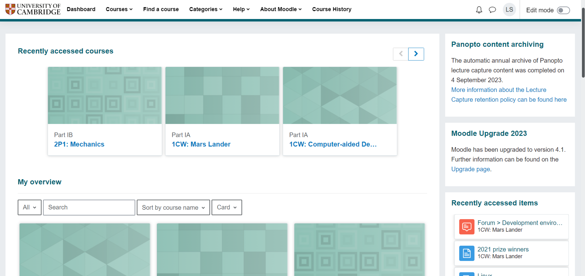
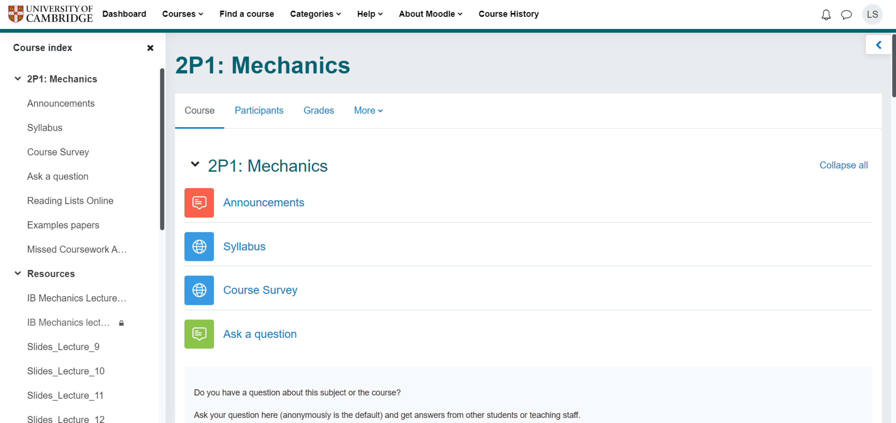
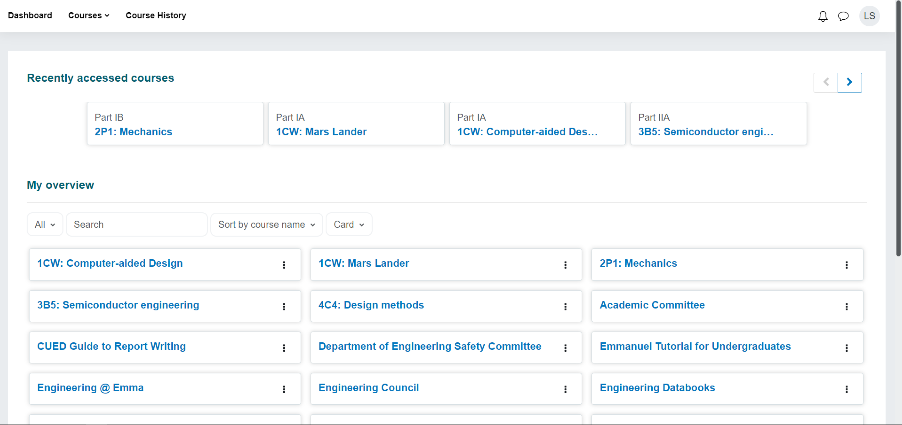
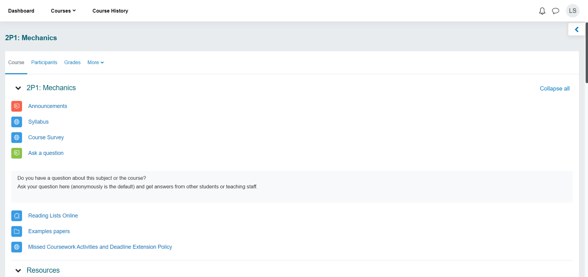
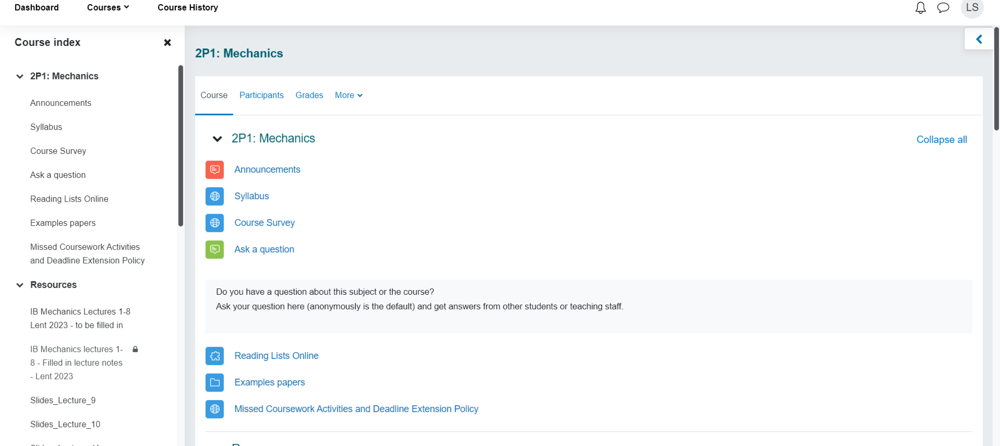
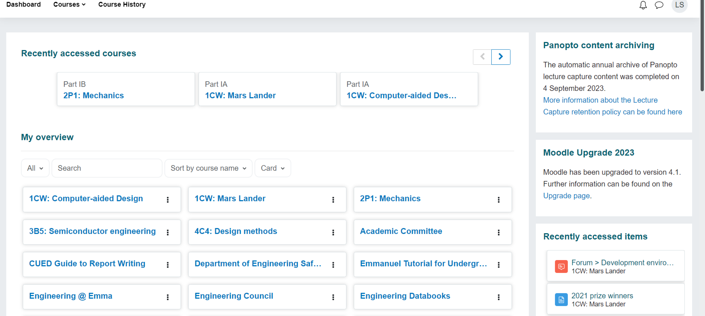
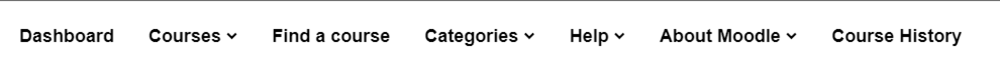
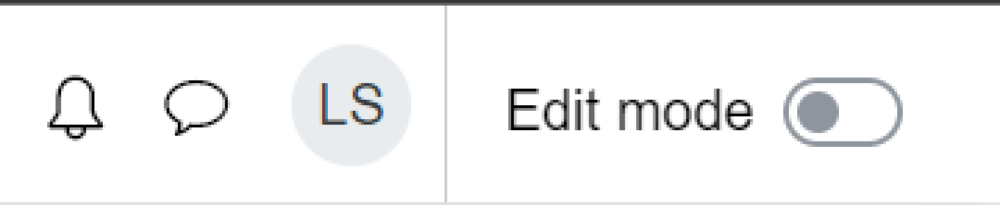

<p align="center">
  
</p>

# Better Cam Moodle

## Description

Since the introduction of Moodle 4.0, the UI for moodle is not as good as it used to be. There are

- Unnecessary card images which take up a lot of space
- Everything is **way too big**
- Inconsistent UI (especially with spacing)
- Sidebar which cannot be hidden

This theme aims to fix all of these issues and make moodle look better. It gives you many options to customize how you want moodle to look like. It also enables auto login!

## Before



## After



## Features

### Remove Course Sidebar

With Sidebar Without

### Remove Dashboard Right Block

With Rightblock Without

### Remove Useless Links

Just remove the useless links at the nav, keeping only the `Dashboard` and `Courses` and `Course History` links.

With Useless Links

### Remove Edit Mode

Remove the edit mode button at the top right corner.

### Auto Login

Automatically login to moodle when you visit the site. No more clicking on the login using Raven button!

# Development

Install the dependencies

```bash
pnpm install
```

Run the dev server

```bash
pnpm dev
```

Open the `src` directory in Chrome extensions and load the unpacked extension.

To build the extension, run

```bash
pnpm build
```

You can then load the extension from the `dist` directory.
